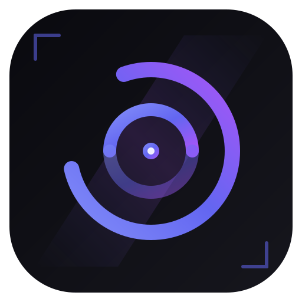

<div align="center">



# 无极

**网页翻译、AI 对话、知识库、广告过滤 — 装一个扩展就够**


</div>

---

## 功能

| 模块 | 说明 |
| --- | --- |
| 网页翻译 | 双语对照翻译，免费 Google / Microsoft 引擎开箱可用，也可接 AI 模型。支持悬停翻译、输入框翻译 |
| AI 对话 | 侧边栏聊天，流式输出，多轮对话，可以配置系统提示词 |
| 图片识别 | 选页面上的图片发给视觉模型，做 OCR 或内容理解 |
| 知识库 | 保存网页 / 对话 / 文件，全文搜索、标签、高亮批注、知识图谱 |
| 广告过滤 | EasyList China 规则 + 自定义规则，DNR 拦截 + 元素隐藏，站点白名单 |
| 标签页休眠 | 自动挂起闲置标签释放内存，白名单、固定页、播放中保护 |
| 弹幕管理姬 | B 站弹幕抓取、弹幕播放器 |
| 保存为 PDF | 把当前网页存成 PDF |

## 支持的模型

基于 OpenAI 兼容 API，填个 Key 就能用：

**国内** DeepSeek · 通义千问 · 智谱 GLM · Kimi · 讯飞星火 · Yi · 文心一言 · MiniMax · 百川 · 阶跃星辰 · 硅基流动

**国外** OpenAI · Claude · Groq · Mistral · Cohere · Perplexity

**视觉模型** 智谱 AI · 通义千问 · Kimi · 阶跃星辰 · OpenAI · Gemini · Claude

也支持自定义 API 地址，任何兼容 OpenAI 协议的服务都能接入。

## 安装

### 开发者模式加载

```bash
git clone https://github.com/chonhxing/---AI-.git
```

1. Chrome / Edge 打开 `chrome://extensions`
2. 开「开发者模式」
3. 点「加载已解压的扩展程序」，选仓库根目录
4. 点工具栏的无极图标 → 设置，填 API Key

### 直接下载

点仓库 **Code → Download ZIP**，解压后同样操作。

## 配置

1. 工具栏点无极图标，进「设置」
2. 语言模型那里选服务商，填 Key 和模型名，点「测试连接」
3. 翻译和视觉模型可以单独配，留空就复用语言模型的 Key

> API Key 只存在浏览器本地，不会上传。

## 技术栈

- Manifest V3（Service Worker + Content Script）
- Shadow DOM 隔离样式
- IndexedDB 本地存储
- FTS 倒排索引 + BM25 检索
- declarativeNetRequest 广告拦截
- WebAssembly（手写 WAT，语言检测 / 哈希 / 编辑距离）
- CSS `:is()` 声明式过滤引擎

## 目录

```
无极/
├── manifest.json          # 扩展配置
├── service-worker.js      # 后台服务
├── ui/                    # 界面
│   ├── popup.html/js/css  # 工具栏弹窗
│   ├── options.html/js    # 设置页
│   └── suspended.html/js  # 休眠页
├── libs/
│   ├── content.js         # 页面脚本
│   ├── translator.js      # 翻译
│   ├── kb-core.js         # 知识库
│   ├── kb-agent.js        # 知识库 Agent
│   ├── tab-suspender.js   # 标签页休眠
│   ├── danmaku-*.js       # 弹幕
│   ├── wasm/              # WebAssembly 内核
│   └── adblock/           # 广告过滤
└── icons/
```

## 支持作者

觉得有用的话点个 ⭐ Star，或者用扩展里的「赞助作者」请我喝杯咖啡。

## 许可证

[MIT](LICENSE)
